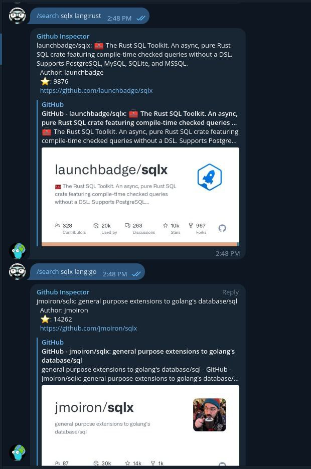

GitHub Inspector - Telegram bot
==============================

Telegram bot meant to support development community, in general, and the Go community, in particular.

This task is achieved by providing two commands:

## Search

`/search` will be focused on returning a single repository of interest, for a better search, more user friendly than opening up a new tab on the browser and typing the name of the repository.

`/search` relies on regular expressions to accomplish the task mentioned above. The command goes like this:
`/search <repository> lang:<lang> author:<author>`

e.g.

`/search dblab author:danvergara lang:go`

As you can see, the name of the repository **should** be the first parameter and the other ones are **optional**. There's no specific order for optional parameters, this command is smart enough to figure out the values, if present.

## Trend

`/trend` will be responsible of returning today's trending repositories on GitHub. The search can be improved and segmented by providing the name of a programming language of interest, but it's optional. The command with no argument will return raw search on the [Trending page](https://github.com/trending).

`/trend <language>`

e.g.

`/trend python`
